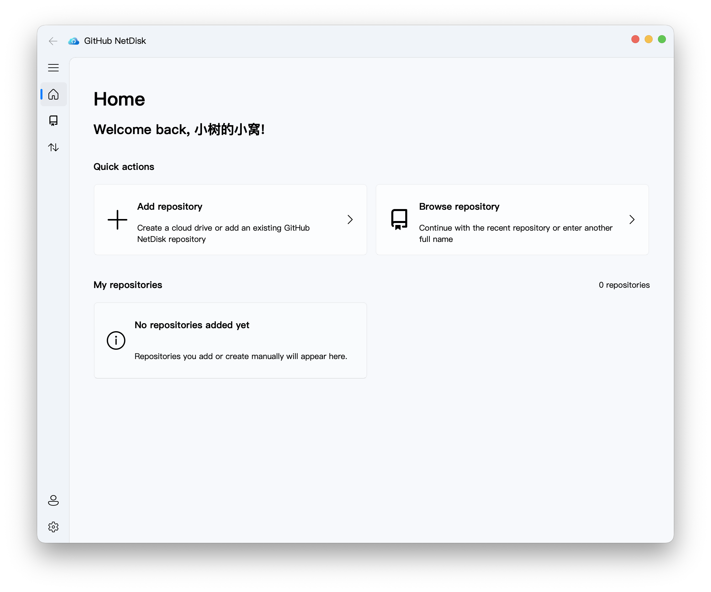

<p align="center">
  
</p>

<h1 align="center">GitHub-NetDisk</h1>

<p align="center">A desktop cloud-drive client that uses GitHub Releases as its storage backend and follows the Fluent Design language.</p>

<p align="center">English | <a href="docs/README_zh.md">简体中文</a> | <a href="docs/README_zh_hk.md">繁體中文</a></p>



## Features

- Browse compatible public repositories without signing in, and access authorized private repositories after signing in.
- Create, add, and manage GitHub-NetDisk repositories from the client.
- Upload, download, rename, and delete files; create and recursively download folders.
- Store file contents in a dedicated GitHub Release while keeping only a lightweight `netdisk.json` index in the Git repository.
- Automatically split files larger than 1.9 GiB into ordered Release assets and verify completed downloads with SHA-256.
- Switch repository branches and quickly reopen recently used repositories.
- Use light or dark themes, HiDPI, and Simplified Chinese, Traditional Chinese, or English.

> [!CAUTION]
> Disclaimer
> 
> This software is not an official GitHub product and is not affiliated with or subordinate to GitHub in any way.
> 
> All storage services are provided by GitHub. Users are responsible for ensuring that the content they publish complies with the laws of their jurisdiction, GitHub's Terms of Service, Acceptable Use Policies, and other GitHub site policies. Contributors to this software accept no responsibility for consequences arising from its use.
> 
> GitHub Release storage, bandwidth, and API requests remain subject to GitHub's terms and quotas. This software does not bypass those limits and must not be used for infringement or service abuse.

## Quick start

Python 3.8–3.11 is recommended.

1. Create a virtual environment and install the dependencies:

```shell
python -m venv .venv
source .venv/bin/activate        # Windows: .venv\Scripts\activate
python -m pip install .
```

To enable accelerated downloads with aria2, install `aria2c` and make sure it is available in the `tools` folder or on `PATH`. The client connects to an existing local aria2 RPC service or automatically starts a private local service for the application. It falls back to the built-in downloader when aria2c is unavailable.

2. Start GitHub NetDisk:

```shell
python GitHub-NetDisk.py
```

On first launch, connecting an account through GitHub App Device Flow is recommended. You can also continue without signing in and use read-only mode. Personal Access Token is available only as an advanced compatibility option, and credentials are stored in the operating-system credential vault.

## Application links

Installed builds register the `github-netdisk://` protocol and support the following formats:

```text
github-netdisk://new-task/download/repo/?uri=owner/repo@branch/path/to/file&filename=file.bin
github-netdisk://new-task/upload/url/?uri=https%3A%2F%2Fexample.com%2Fupload&filename=/local/file.bin
github-netdisk://browse-repo/?repo=owner/repo&branch=main
```

Opening a new-task link first displays a task dialog populated with the corresponding values and waits for user confirmation.

## Tests

```shell
python -m pip install -e ".[dev]"
pytest -q
```

Live GitHub integration tests are skipped by default and can be explicitly enabled with an environment variable:

```shell
GITHUB_NETDISK_INTEGRATION=1 pytest -q test/test_netdisk.py
```

## Deployment

1. Run the deployment script:

```shell
python -m pip install -e ".[build]"
python deploy.py
```

2. If the `aria2c` executable is stored in the `tools` folder, copy the `tools` folder into the packaged application:
   - Windows/Linux: copy it to the packaged application's `tools` directory.
   - macOS: copy it to `dist/GitHub-NetDisk.app/Contents/MacOS/tools`.

## Acknowledgements

- [PyQt5](https://pypi.org/project/PyQt5/) — Python bindings for Qt 5.
- [PyQt-Fluent-Widgets](https://github.com/zhiyiYo/PyQt-Fluent-Widgets) — Fluent Design widgets for PyQt and PySide.
- [PyGithub](https://github.com/PyGithub/PyGithub) — A GitHub API client.
- [Requests](https://requests.readthedocs.io/) — HTTP requests and the built-in download fallback.
- [keyring](https://github.com/jaraco/keyring) — Operating-system credential storage.
- [Loguru](https://github.com/Delgan/loguru) — Application logging.
- [pyqt5-concurrent](https://pypi.org/project/pyqt5-concurrent/) — Background tasks integrated with Qt.
- [aria2](https://aria2.github.io/) — An optional concurrent download accelerator.

This software also draws heavily on the project structure and coding style of [Fluent-M3U8](https://github.com/zhiyiYo/Fluent-M3U8). Special thanks to [@zhiyiYo](https://github.com/zhiyiYo)!

## License

GitHub NetDisk is licensed under GPL-3.0.

Copyright © 2026 XiaoshuDeXiaowo.
