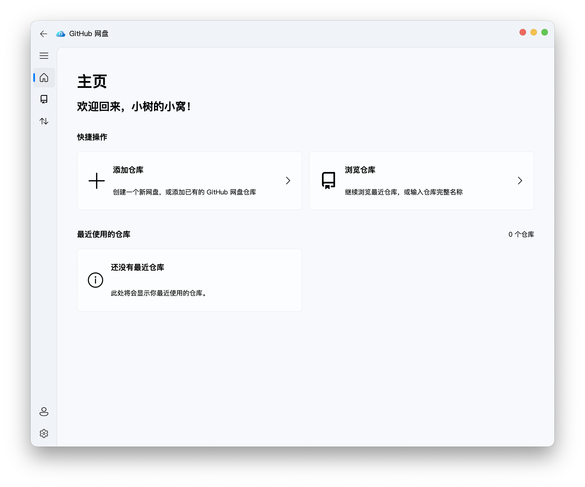

<p align="center">
  
</p>

<h1 align="center">GitHub-NetDisk</h1>

<p align="center">一款以 GitHub Release 为存储后端并采用 Fluent Design 设计语言的桌面网盘客户端。</p>

<p align="center"><a href="../README.md">English</a> | 简体中文 | <a href="README_zh_hk.md">繁體中文</a></p>



## 功能

- 无需登录即可浏览兼容的公开仓库；登录后可访问授权的私有仓库。
- 在客户端内创建、添加并管理 GitHub-NetDisk 仓库。
- 支持文件上传、下载、重命名、删除，以及文件夹创建和递归下载。
- 文件内容存放在独立 GitHub Release 中，Git 仓库只保留轻量的 `netdisk.json` 索引。
- 超过 1.9 GiB 的文件会自动拆分为有序 Release 资产；下载完成后使用 SHA-256 校验。
- 支持仓库分支切换和最近使用仓库快捷入口。
- 支持浅色/深色主题和高DPI，以及简体中文、繁体中文和英文。

> [!CAUTION] 免责声明
> 本软件不是 GitHub 官方软件，与 GitHub 无任何从属或隶属关系。
> 所有存储服务均由 GitHub 提供，用户自行确保发布的内容不违反用户所在地的法律与 GitHub 的服务条款、可接受使用政策及其他 GitHub 站点政策。本软件的所有贡献者均不因用户的使用导致的后果承担任何责任。
> GitHub Release 存储空间、流量和 API 调用次数均受 GitHub 服务条款与配额限制。本软件不会绕过这些限制，也不应被用于侵权或滥用服务。

## 快速开始

推荐 Python 3.8–3.11。

1. 创建虚拟环境并安装依赖：

```shell
python -m venv .venv
source .venv/bin/activate        # Windows：.venv\Scripts\activate
python -m pip install .
```

如需启用 aria2 加速下载，请安装 `aria2c` 并确保它位于 `tools` 文件夹或 `PATH` 中。客户端会连接已有的本地 aria2 RPC 服务，或自动启动一个仅供本应用使用的本地服务；找不到 aria2c 时会回退到内置下载器。

2. 启动 GitHub 网盘

``` shell
python GitHub-NetDisk.py
```

首次启动时推荐通过 GitHub App Device Flow 连接账号，也可以暂不登录并以只读模式使用。Personal Access Token 仅作为高级兼容选项；凭据保存在操作系统凭据库中。

## 应用链接

安装后的应用会注册 `github-netdisk://` 协议，支持以下格式：

```text
github-netdisk://new-task/download/repo/?uri=owner/repo@branch/path/to/file&filename=file.bin
github-netdisk://new-task/upload/url/?uri=https%3A%2F%2Fexample.com%2Fupload&filename=/local/file.bin
github-netdisk://browse-repo/?repo=owner/repo&branch=main
```

打开新任务链接后，应用会先显示已填入相应内容的任务对话框，等待用户确认。

## 测试

```shell
python -m pip install -e ".[dev]"
pytest -q
```

真实 GitHub 集成测试默认跳过，可通过环境变量显式开启：

```shell
GITHUB_NETDISK_INTEGRATION=1 pytest -q test/test_netdisk.py
```

## 部署

1. 运行部署脚本：

```shell
python -m pip install -e ".[build]"
python deploy.py
```

2. 如果将 `aria2c` 可执行文件放在 `tools` 文件夹中，则需要复制 `tools` 文件夹到打包目录:
   - 对于 Windows/Linux：复制到打包后应用的 `tools` 目录。
   - 对于 macOS：复制为 `dist/GitHub-NetDisk.app/Contents/MacOS/tools`。

## 致谢

- [PyQt5](https://pypi.org/project/PyQt5/) — Qt 5 的 Python 绑定。
- [PyQt-Fluent-Widgets](https://github.com/zhiyiYo/PyQt-Fluent-Widgets) — 面向 PyQt 与 PySide 的 Fluent Design 组件库。
- [PyGithub](https://github.com/PyGithub/PyGithub) — GitHub API 客户端。
- [Requests](https://requests.readthedocs.io/) — HTTP 请求与内置下载回退。
- [keyring](https://github.com/jaraco/keyring) — 操作系统凭据存储。
- [Loguru](https://github.com/Delgan/loguru) — 应用日志。
- [pyqt5-concurrent](https://pypi.org/project/pyqt5-concurrent/) — 与 Qt 集成的后台任务。
- [aria2](https://aria2.github.io/) — 可选的并发下载加速工具。

另外，本软件在编写过程中大量参考了 [Fluent-M3U8](https://github.com/zhiyiYo/Fluent-M3U8) 的项目结构和代码风格，在此特别感谢 [@zhiyiYo](https://github.com/zhiyiYo) ！

## 许可证

GitHub 网盘 使用 GPL-3.0 许可证进行授权。

版权所有 © 2026 小树的小窝。
