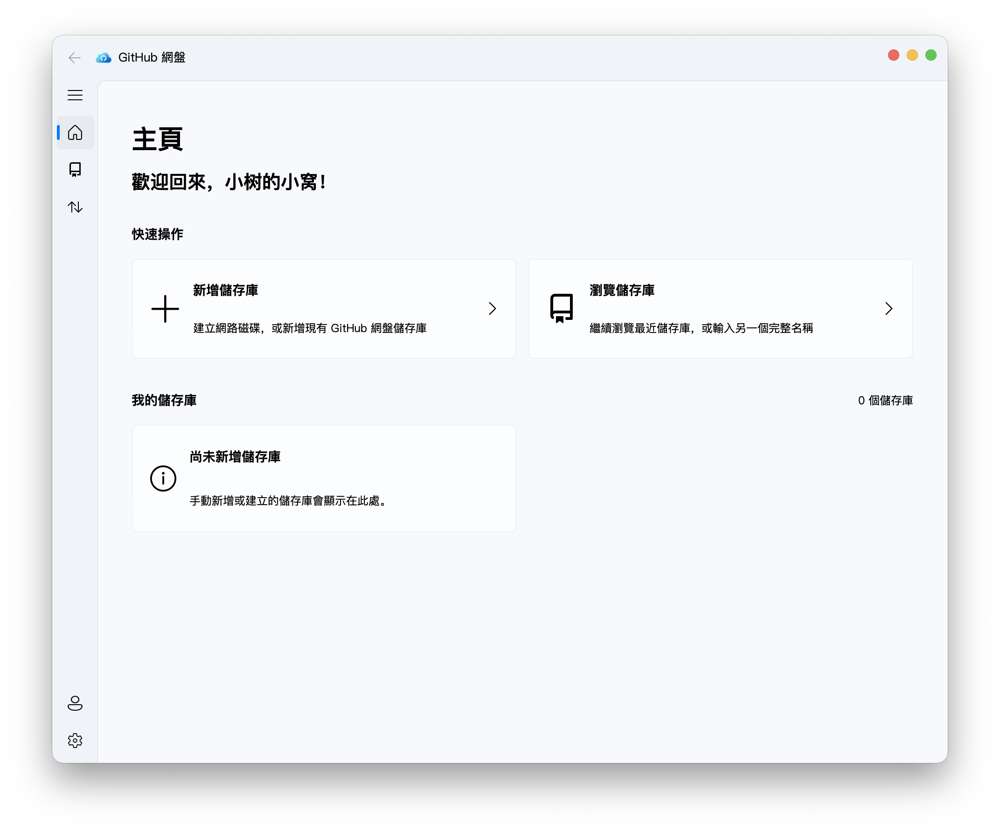

<p align="center">
  
</p>

<h1 align="center">GitHub-NetDisk</h1>

<p align="center">一款以 GitHub Release 作為儲存後端，並採用 Fluent Design 設計語言的桌面雲端硬碟用戶端。</p>

<p align="center"><a href="../README.md">English</a> | <a href="README_zh.md">简体中文</a> | 繁體中文</p>



## 功能

- 無需登入即可瀏覽相容的公開儲存庫；登入後可存取已授權的私人儲存庫。
- 在用戶端內建立、新增並管理 GitHub-NetDisk 儲存庫。
- 支援檔案上傳、下載、重新命名、刪除，以及資料夾建立和遞迴下載。
- 檔案內容存放在獨立的 GitHub Release 中，Git 儲存庫只保留輕量的 `netdisk.json` 索引。
- 超過 1.9 GiB 的檔案會自動分割為有序的 Release 資產；下載完成後使用 SHA-256 驗證。
- 支援儲存庫分支切換和最近使用儲存庫的快速入口。
- 支援淺色／深色主題和高 DPI，以及繁體中文、簡體中文和英文。

> [!CAUTION]
> 免責聲明
> 
> 本軟體並非 GitHub 官方軟體，與 GitHub 沒有任何從屬或隸屬關係。
> 
> 所有儲存服務均由 GitHub 提供。使用者須自行確保所發佈的內容不違反使用者所在地的法律、GitHub 的服務條款、可接受使用政策及其他 GitHub 網站政策。本軟體的所有貢獻者均不對使用者使用本軟體所導致的後果承擔任何責任。
> 
> GitHub Release 儲存空間、流量和 API 呼叫次數均受 GitHub 服務條款與配額限制。本軟體不會繞過這些限制，也不應用於侵權或濫用服務。

## 快速開始

建議使用 Python 3.8–3.11。

1. 建立虛擬環境並安裝相依套件：

```shell
python -m venv .venv
source .venv/bin/activate        # Windows：.venv\Scripts\activate
python -m pip install .
```

如需啟用 aria2 加速下載，請安裝 `aria2c`，並確保它位於 `tools` 資料夾或 `PATH` 中。用戶端會連接現有的本機 aria2 RPC 服務，或自動啟動一個僅供本應用程式使用的本機服務；找不到 aria2c 時會改用內建下載器。

2. 啟動 GitHub 網盤：

```shell
python GitHub-NetDisk.py
```

首次啟動時，建議透過 GitHub App Device Flow 連接帳戶；也可以暫不登入並以唯讀模式使用。Personal Access Token 僅作為進階相容選項；憑證會儲存在作業系統的憑證庫中。

## 應用程式連結

安裝後的應用程式會註冊 `github-netdisk://` 通訊協定，並支援以下格式：

```text
github-netdisk://new-task/download/repo/?uri=owner/repo@branch/path/to/file&filename=file.bin
github-netdisk://new-task/upload/url/?uri=https%3A%2F%2Fexample.com%2Fupload&filename=/local/file.bin
github-netdisk://browse-repo/?repo=owner/repo&branch=main
```

開啟新任務連結後，應用程式會先顯示已填入相應內容的任務對話方塊，等待使用者確認。

## 測試

```shell
python -m pip install -e ".[dev]"
pytest -q
```

真實 GitHub 整合測試預設會略過，可透過環境變數明確啟用：

```shell
GITHUB_NETDISK_INTEGRATION=1 pytest -q test/test_netdisk.py
```

## 部署

1. 執行部署指令碼：

```shell
python -m pip install -e ".[build]"
python deploy.py
```

2. 如果將 `aria2c` 執行檔放在 `tools` 資料夾中，則需要將 `tools` 資料夾複製到封裝目錄：
   - Windows/Linux：複製到封裝後應用程式的 `tools` 目錄。
   - macOS：複製為 `dist/GitHub-NetDisk.app/Contents/MacOS/tools`。

## 致謝

- [PyQt5](https://pypi.org/project/PyQt5/) — Qt 5 的 Python 繫結。
- [PyQt-Fluent-Widgets](https://github.com/zhiyiYo/PyQt-Fluent-Widgets) — 適用於 PyQt 與 PySide 的 Fluent Design 元件庫。
- [PyGithub](https://github.com/PyGithub/PyGithub) — GitHub API 用戶端。
- [Requests](https://requests.readthedocs.io/) — HTTP 請求與內建下載備援。
- [keyring](https://github.com/jaraco/keyring) — 作業系統憑證儲存。
- [Loguru](https://github.com/Delgan/loguru) — 應用程式日誌。
- [pyqt5-concurrent](https://pypi.org/project/pyqt5-concurrent/) — 與 Qt 整合的背景任務。
- [aria2](https://aria2.github.io/) — 選用的並行下載加速工具。

此外，本軟體在開發過程中大量參考了 [Fluent-M3U8](https://github.com/zhiyiYo/Fluent-M3U8) 的專案結構和程式碼風格，在此特別感謝 [@zhiyiYo](https://github.com/zhiyiYo)！

## 授權條款

GitHub 網盤採用 GPL-3.0 授權條款。

著作權所有 © 2026 小樹的小窩。
